# Practical-Assignment-17

## Project Name - "Comparing Classifiers"

**Business Understanding of the Problem:**

This is the third practical application assignment, and its primary objective is to compare the performance of various classification algorithms — including k-Nearest Neighbors, Logistic Regression, Decision Trees, and Support Vector Machines — introduced throughout the program. For this purpose, we will utilize a dataset related to the telephone-based marketing of bank products. To gain deeper insights into the problem we aim to address, it is essential to first understand the origin of the data and its relevance in real-world scenarios. 

**Source Dataset and Insights on dataset:**

The dataset used in this project is sourced from the [UC Irvine Machine Learning Repository](https://archive.ics.uci.edu/dataset/222/bank+marketing) . It originates from a Portuguese banking institution and comprises data collected from multiple marketing campaigns aimed at promoting term deposit subscriptions. The dataset includes various client and campaign-related attributes, making it well-suited for classification and predictive modeling tasks. For more information, we have used the article accompaying the dataset [here](https://github.com/PoojaSinha8809/Practical-Assignment-17/blob/main/CRISP-DM-BANK.pdf)

In the project, we have used the dataset located here - "data/bank-additional/bank-additional-full.csv". This bank-additional-full.csv contains all examples (41188) and 20 inputs, ordered by date (from May 2008 to November 2010), very close to the data analyzed. 

With reference to paper study, we are going to use CRISP-DM methodology. This dataset contains real-world data collected from a series of marketing campaigns conducted by a Portuguese banking institution, specifically aimed at promoting term deposit subscriptions. The primary business objective is to develop a model that can predict the success of a contact — that is, whether a client will subscribe to a deposit. Such a model can significantly enhance campaign efficiency by identifying the key factors influencing customer decisions. This, in turn, supports better allocation of resources, such as time, personnel, and communication efforts, and enables the selection of a more targeted and cost-effective group of potential customers.

The techiqiue we used in reference to the paper follows CRISP DM framework, which can be find below: 

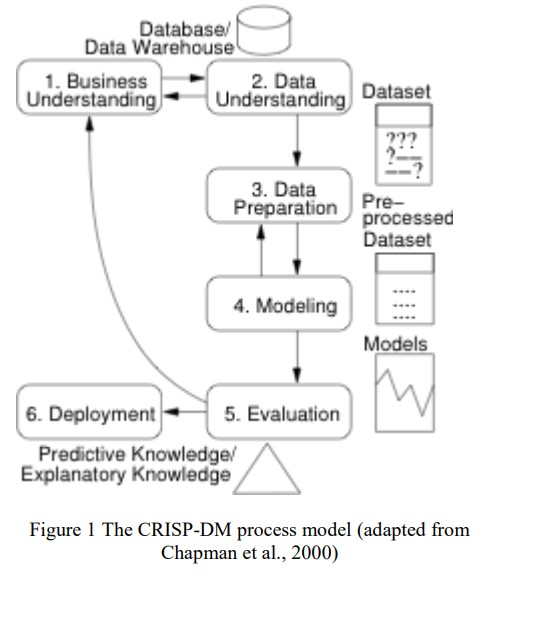

## Key Steps in the Project:
    
### Data Understanding and Preprocessing: 
In this phase, we begin by loading the CSV file into a Pandas DataFrame to facilitate data analysis and exploration. This allows us to examine the relationships between various features in the dataset and understand their potential impact on client decisions. As part of the data preprocessing, we check for and address duplicate entries, missing values, and any inappropriate or inconsistent data. Ensuring data quality is essential for building robust and accurate models. Additionally, we employ various data visualization techniques to explore feature distributions and identify patterns or trends that may influence a client's decision to subscribe to a term deposit. These visual insights help guide the selection of relevant features for modeling.

**Understanding the features:**

In the data exploration, we find that there is no missing value in the dataset. So based on features data we have categorized the data further. 
Data Categorization

Here’s how the data can be categorized into Client Profile, Marketing Data, and Output Variable:

**Client Profile (Personal and Socioeconomic Data): This category includes data that describes the client’s personal attributes, demographic information, and their socioeconomic context.**
- Age (numeric) – Age of the client.
- Job (categorical) – Type of job (e.g., 'admin.', 'blue-collar', 'entrepreneur', etc.).
- Marital (categorical) – Marital status (e.g., 'divorced', 'married', 'single', etc.).
- Education (categorical) – Level of education (e.g., 'basic.4y', 'university.degree', etc.).
- Default (categorical) – Whether the client has credit in default ('no', 'yes', 'unknown').
- Housing (categorical) – Whether the client has a housing loan ('no', 'yes', 'unknown').
- Loan (categorical) – Whether the client has a personal loan ('no', 'yes', 'unknown').

**Marketing Data (Campaign and Contact Information): This category includes data related to the client’s interactions during the current and previous marketing campaigns.**

- Contact (categorical) – Communication type used for contact ('cellular', 'telephone').
- Month (categorical) – Month of the last contact ('jan', 'feb', ..., 'dec').
- Day of Week (categorical) – Day of the week of the last contact ('mon', 'tue', ..., 'fri').
- Duration (numeric) – Duration of the last contact in seconds (Important note: should only be included for benchmarking purposes as it is not  available before the call).
- Campaign (numeric) – Number of contacts made during the current campaign for this client (includes the last contact).
- Pdays (numeric) – Number of days since the client was last contacted in a previous campaign (999 means no previous contact).
- Previous (numeric) – Number of contacts made before this campaign for this client.
- Poutcome (categorical) – Outcome of the previous campaign ('failure', 'nonexistent', 'success').
- Output Variable (Target Variable): This category includes the desired outcome of the campaign that we aim to predict.
- Y (binary) – Has the client subscribed to a term deposit? ('yes', 'no').

**Social and Economic Context Data: This category includes broader economic and social context indicators that might influence campaign success but are not specific to the client.**

- Emp.var.rate (numeric) – Employment variation rate (quarterly indicator).
- Cons.price.idx (numeric) – Consumer price index (monthly indicator).
- Cons.conf.idx (numeric) – Consumer confidence index (monthly indicator).
- Euribor3m (numeric) – Euribor 3-month rate (daily indicator).
- Nr.employed (numeric) – Number of employees (quarterly indicator).

**Summary of Categories:**

- Client Profile: Attributes related to the individual’s personal and socioeconomic information.
- Marketing Data: Attributes related to the client’s interaction in the campaign and previous campaign outcomes.
- Output Variable: The target we aim to predict, i.e., whether the client subscribed to the term deposit.
- Social and Economic Context Data: Broader contextual data that may influence campaign outcomes.

This categorization helps organize the data based on its role in the predictive modeling process and ensures a clearer structure for analyzing the factors contributing to the success of the marketing campaign.

### Findings on Data Analysis:

n our analysis, we utilized a variety of data visualization techniques to gain deeper insights into the dataset and support informed decision-making during model development. One of the key areas we explored was data balance, particularly in terms of class distribution, to determine whether the dataset was imbalanced — a common issue that can significantly affect the performance of classification models. Visualization tools such as bar plots or pie charts were used to clearly represent the proportion of each class (e.g., clients who subscribed vs. those who did not).

We also analyzed feature correlation using heatmaps and correlation matrices to identify relationships between numerical variables. This helped in detecting multicollinearity, which can affect certain models like Logistic Regression, and also in understanding which features might be redundant or highly related.

Furthermore, we explored the impact of individual features on the target variable using box plots, count plots, and scatter plots. These visualizations provided valuable insight into which attributes (e.g., age, job type, previous contact outcome) were more likely to influence a client’s decision to subscribe to a term deposit. Understanding these relationships was essential for feature selection and for improving the overall performance and interpretability of the classification models.

We conducted Exploratory Data Analysis (EDA) on both numerical and categorical features to better understand the structure and distribution of the data. For numerical variables, we examined summary statistics, distributions, and outliers using tools such as histograms, box plots, and correlation matrices. For categorical variables, we analyzed the frequency of each category, visualized relationships with the target variable using count plots and bar charts, and assessed their potential impact on model performance. This comprehensive EDA helped uncover hidden patterns, detect anomalies, and guide feature selection for building effective classification models.

**In EDA of Numerical Data, we got following result :**

If the values for emp.var.rate (employment variation rate) and cons.price.idx (consumer price index) have negative values, it's important to interpret them correctly, as these are indicators of economic trends.

Here’s what the negative values represent:

1. Emp.var.rate (Employment Variation Rate)

- Interpretation of Negative Values:

>> This variable measures the quarterly change in employment. A negative value indicates a decrease in employment or a decline in the number of employed individuals in that quarter.

For example, if emp.var.rate = -3.4, it means that employment has decreased by 3.4% in that quarter.

2. Cons.price.idx (Consumer Price Index)

- Interpretation of Negative Values:

>> The consumer price index (CPI) measures the average change in prices paid by consumers for goods and services. A negative value suggests a deflationary trend, meaning that overall prices are decreasing.

For example, if cons.price.idx = -50.8, this suggests that the consumer price index dropped by 50.8 points compared to the previous period.This could indicate a drastic decline in prices (deflation), often caused by a significant reduction in demand, a financial crisis, or other extreme economic conditions.

Why Negative Values Occur?

- Economic Downturn: Both of these indicators can be negative during periods of economic recession or downturn, reflecting issues like rising unemployment and declining prices.

- Deflation: A negative CPI (consumer price index) could signal deflation, which can happen during economic recessions when there is reduced demand for goods and services, leading to lower prices.

How to Handle Negative Values in Our Model?

- No Action Needed if Interpreted Correctly: If these negative values are correctly understood as indicators of economic conditions, they can be used directly in the model to represent their economic meaning.

- Feature Scaling: Depending on the algorithm we're using, it might be beneficial to normalize or standardize these variables to ensure that they have a similar scale to the other features in the dataset. For example, using z-scores or Min-Max scaling can help the model handle both negative and positive values appropriately.

- Contextual Importance: Keep in mind that negative values in these features could indicate important patterns in the data, such as economic conditions influencing customer behavior. Including them can improve the model’s ability to predict client behavior in different economic environments.

**Conclusion:** Negative values in emp.var.rate and cons.price.idx are not inherently problematic. They simply reflect economic conditions such as employment declines or price deflation. As long as we understand their implications, these negative values can be incorporated into the model to help identify patterns and trends related to campaign success.

**Let's have a look at Explortory Data Analysis on categorical data:**

For categorical we will use the subscription status values and review its frquency distribution.
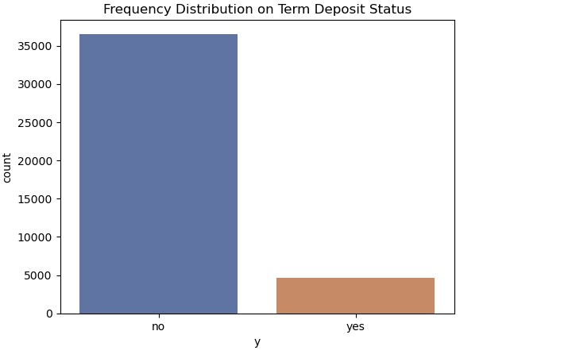

We did following analysis to understand each feature :

- **Univariate Analysis:**
>> Univariate analysis involves examining a single variable at a time to understand its distribution and characteristics. It helps in understanding the basic properties of individual features within the dataset.
- **Bivariate Analysis:**
>> Bivariate analysis examines the relationship between two variables. It helps us understand how two variables are related to each other, and if one can help predict the other
- **Multivariate Analysis:**
>> Multivariate analysis involves examining more than two variables at once to understand the complex interactions and relationships among them. Techniques like pair plots, heatmaps of correlations, or 3D scatter plots are useful for visualizing interactions between multiple numerical variables. 

Let's see the overview on each type of analysis and findings:
1. **Univariate Analysis:**

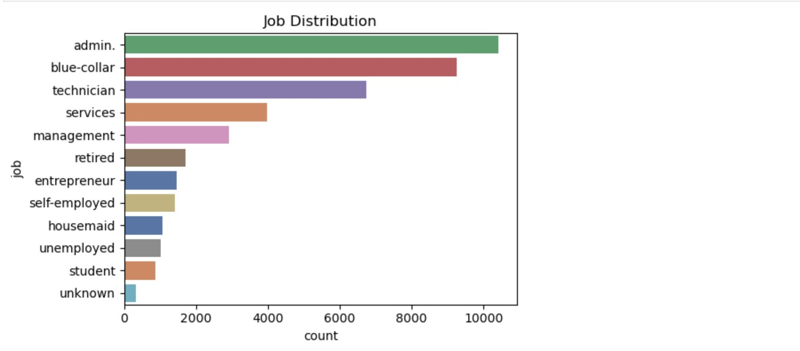

Upon analyzing the job distribution, it is evident that the number of entries labeled as 'unknown' is very low. Given their minimal impact on the overall dataset, it is considered safe to remove these rows without significantly affecting the analysis.

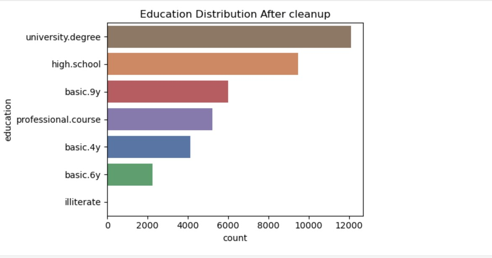

Analyzing the education distribution graph, we observe that the number of entries with 'unknown' education levels is relatively low compared to the overall dataset. Although the count of 'illiterate' entries is even smaller, it is not advisable to remove them, as they represent a valid category of education. In contrast, 'unknown' values do not provide meaningful information and may introduce noise into the dataset. Therefore, removing rows with 'unknown' education levels is a safer and more logical step toward ensuring a cleaner dataset, which is essential for building a reliable and accurate model.

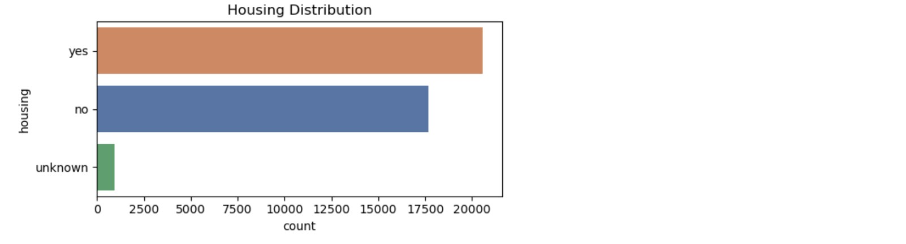

From the Housing Distribution graph, it is evident that the number of clients with an 'unknown' housing loan status is very small in comparison to those with clearly defined statuses (i.e., 'yes' or 'no'). Since this category constitutes only a negligible portion of the dataset, retaining these rows adds little value to the analysis and may introduce unnecessary noise. By removing the entries with 'unknown' housing loan status, we can simplify the dataset and achieve a clearer, more accurate understanding of the distribution between clients who have a housing loan and those who do not. This step also helps improve the quality of the data, which is essential for building a robust and interpretable model.

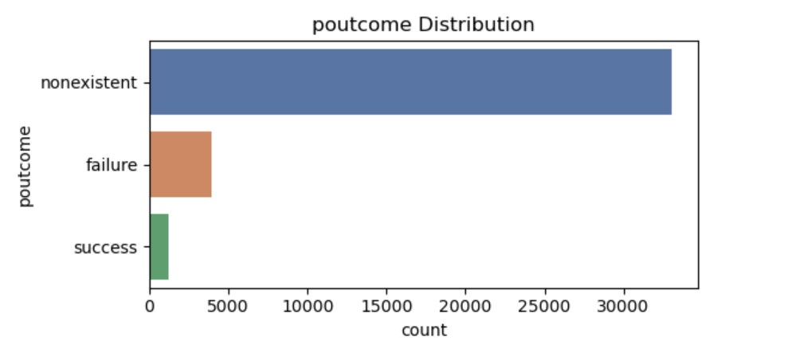

The outcome of previous campaigns plays a crucial role in bank marketing by providing valuable insights into customer preferences, behaviors, and the effectiveness of past strategies. Analyzing past campaign outcomes helps banks identify what worked well and what didn't, allowing them to refine their marketing strategies, optimize customer targeting, and improve engagement in future campaigns. It also enables banks to personalize their offerings based on customer feedback and responses, leading to better conversion rates and stronger customer relationships.

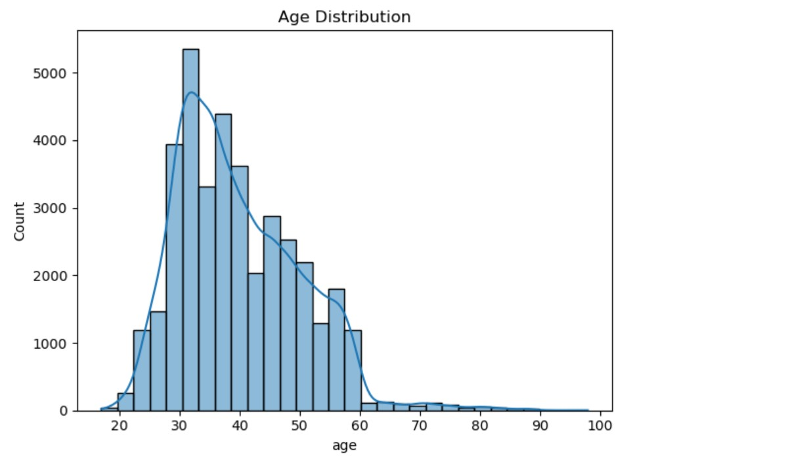

The histogram, combined with a Kernel Density Estimate (KDE) curve, provides a detailed view of the age distribution among the clients. The distribution appears to be right-skewed, indicating that the majority of clients fall within the age range of approximately 25 to 60 years. This skewness suggests that younger and middle-aged individuals are more commonly represented in the dataset, while the number of clients decreases gradually as age increases beyond 60. Understanding this age distribution is important, as it can influence various aspects of the analysis, including marketing strategies, customer segmentation, and model performance. The KDE curve also helps smooth out the histogram, making it easier to observe the general pattern and central tendencies within the age variable.

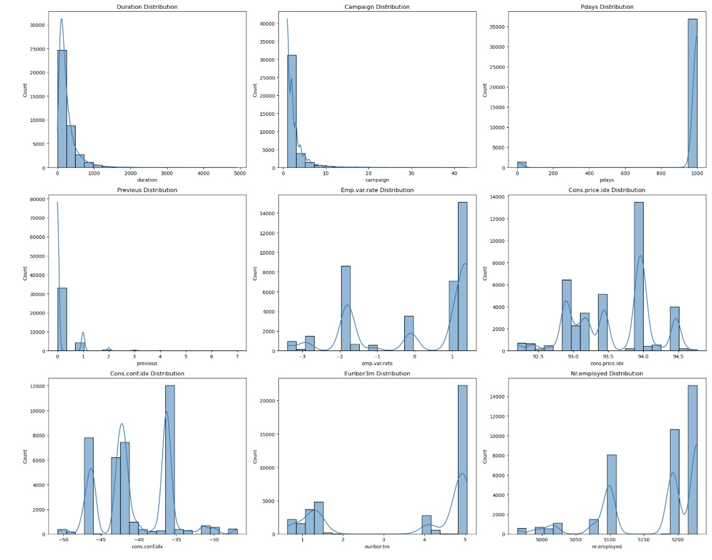

These visualizations help understand the underlying patterns and spread of each variable, which is crucial for exploratory data analysis (EDA) and model preparation.

- Duration: The graph is right-skewed distribution, we can have an interpretation like -  most calls are short; very few are long. Long durations often correlate positively with a successful outcome. This interpretation helped in deciding if we need this info for model training. 

- Campaign: Indicates the number of contacts performed during this campaign for each client. A high number of contacts could indicate diminishing returns or potential annoyance, which might reduce conversion rates.

- Previous Distribution: Reflects the number of contacts before the campaign with an each client. The distribution is Right-skewed, with many zeros. Most clients had no prior contact. Non-zero values may indicate higher interest or persistent marketing efforts.

- Pdays Distribution: Shows the number of days passed by, after the client was last contacted from a previous campaign. 999 usually means the client was not previously contacted. The distribution has large spike at 999. From the interpreation, we can find majority of clients were never contacted before. You might treat this as a separate category rather than a continuous variable.

- Emp.var.rate Distribution: Shows Employment variation rate (quarterly indicator). The distribution is discrete with only a few values. From the interpretation we can find that plot indicate the economic situation during the time of the campaign. Can be a strong predictor of success in financial product marketing.

- Cons.price.idx Distribution: Shows Consumer price index (monthly indicator). In the distribution we have sharp peak at one or two values. it's not perfectly symmetric. The interpreation represents the price inflation. Could influence clients’ financial decisions.

- Cons.conf.idx Distribution: Shows Consumer confidence index (monthly indicator). Confidence value is negative so it reflects general public sentiment about the economy. Lower confidence might reduce willingness to invest.

- Euribor3m Distribution: Shows Euribor 3-month rate (daily indicator). Interest rate trends can heavily influence financial decision-making. Lower rates may correlate with higher marketing success.

- Nr.employed Distribution: Shows Number of employees (quarterly indicator). The distribution is discrete, with peaks at specific values. Reflects employment trends. Certain values may align with economic stability, impacting consumer behavior.

2. **Bivariate Analysis:**

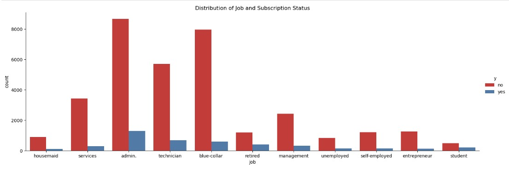

The categorical plot provides a clear visualization of the number of clients contacted within each job category, with an added segmentation based on whether or not they subscribed to a term deposit. The plot highlights that clients in certain job sectors, particularly those in 'admin,' 'blue-collar,' and 'technician' roles, show a significantly higher subscription rate to the term deposit compared to clients from other job categories. This suggests that these professions are more likely to engage with the offered financial product, possibly due to factors such as income stability, job security, or financial awareness associated with these sectors. On the other hand, job categories like 'student,' 'retired,' and 'housemaid' exhibit lower subscription rates, which could be influenced by factors such as financial constraints or a lower propensity to invest. These insights can help tailor marketing strategies by focusing more on the job categories with higher subscription rates, potentially boosting conversion rates for the term deposit offering.

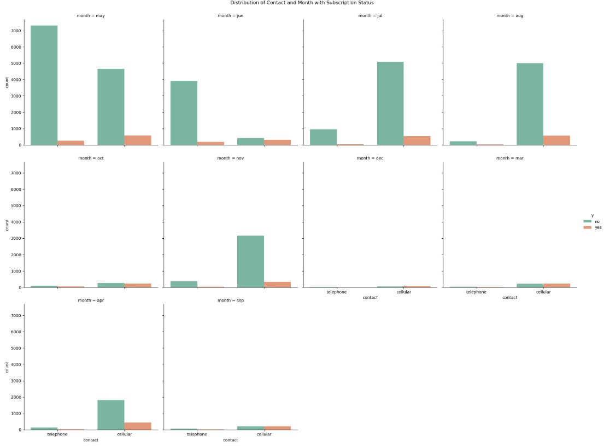

The plot provides a visual comparison of the contact methods used throughout the marketing campaign across various months, with a breakdown based on clients' subscription status. It reveals that the months of May, June, July, and August experienced the highest frequencies of contact via cellular methods. However, despite the increased outreach during these months, the subscription rate for the term deposit ('Yes' response) remains lower than the non-subscription rate ('No' response). This indicates that, although cellular contact was the predominant method during these months, it had a relatively lower success rate in converting clients to subscribe to the term deposit. This insight suggests that while cellular contact may have been the most frequent, it might not have been the most effective method in securing subscriptions during these particular months.

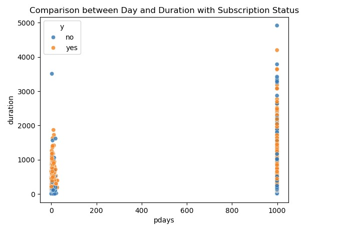

The plot illustrates the relationship between the variable 'pday' (the number of days since the client was last contacted) and 'duration' (the duration of the last contact in seconds), with the data segmented by clients' subscription status to a term deposit. The visualization helps to identify patterns in how the timing of the last contact (pday) and the length of the contact (duration) correlate with a client's decision to subscribe to the term deposit. It appears that longer call durations are more likely to be associated with successful subscriptions ('Yes'), suggesting that extended conversations may lead to more successful conversions. On the other hand, clients who were contacted more recently (lower 'pday' values) might show higher engagement, but the subscription rate doesn't always correspond to shorter contact times. This plot provides valuable insights into how both the timing and the quality (duration) of contact may influence the likelihood of a successful subscription, highlighting potential areas for optimizing marketing strategies, such as prioritizing longer calls or specific timing for future outreach

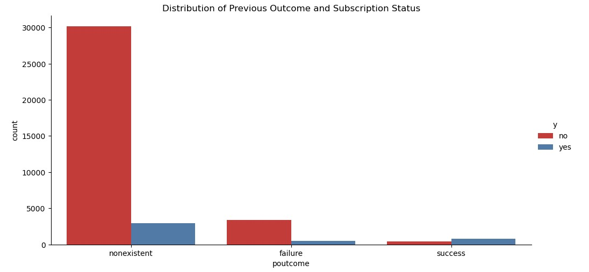

This visualization offers valuable insights into the relationship between clients' marital status and education levels, segmented by their loan status and subscription to a term deposit. By examining how these demographic variables interact with the loan status, we can gain a deeper understanding of how marital and educational factors influence clients' financial decisions. For instance, it may be possible to observe trends where married clients or those with higher education levels are more likely to subscribe to a term deposit. However, despite this segmentation, the overall analysis reveals that the subscription rate for 'No' (non-subscribers) remains higher than the 'Yes' (subscribers) rate, indicating a lower success rate for term deposit subscriptions across the board. This suggests that, while certain demographic groups may show higher interest in term deposits, the overall conversion rate is still relatively low, highlighting potential areas for improving marketing strategies, targeting more promising customer segments, or adjusting the product offering to increase subscription rates.

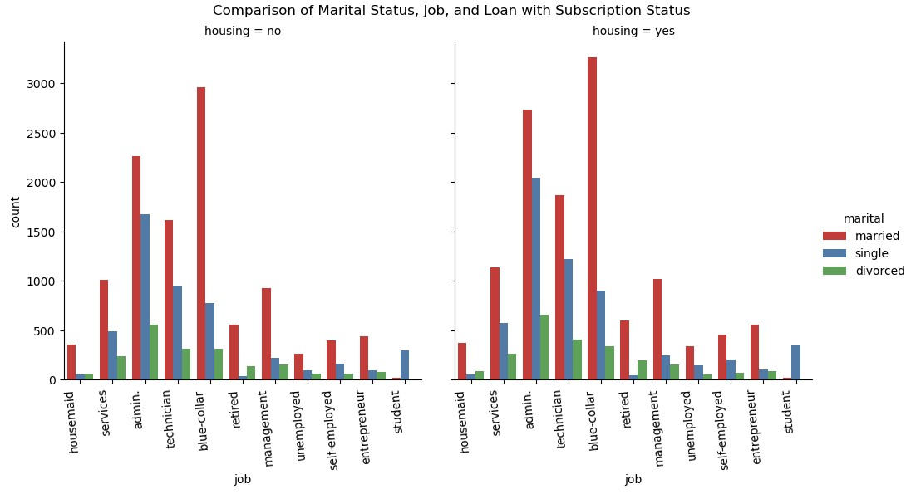

This plot compares the distribution of clients' job types and marital status, with a further segmentation based on whether or not they have a housing loan. The visualization provides an insightful look into how these demographic factors intersect with clients' housing loan status and their likelihood of subscribing to a term deposit. By observing the differences between job categories and marital status, we can discern patterns in how certain professions or relationship statuses may influence a client's financial decisions. Notably, the plot shows that the subscription rate for clients with a 'Yes' response (i.e., those who subscribed to a term deposit) is consistently higher than for those who answered 'No' (i.e., non-subscribers). This indicates a relatively higher success rate in converting clients to term deposits among certain job sectors or marital statuses. For example, it may reveal that individuals in more stable or higher-income professions, or those in certain marital statuses, are more likely to subscribe to a term deposit. These insights could be valuable for refining marketing strategies, as targeting specific professions or marital groups with higher subscription rates could potentially increase overall conversion rates for the term deposit offering.

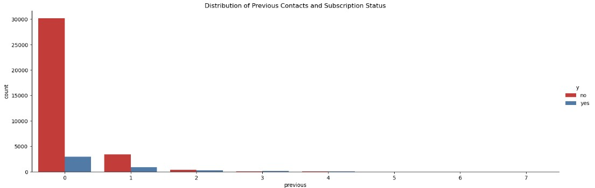

This plot visualizes the relationship between clients' outcomes from previous marketing campaigns and their current subscription status to a term deposit. By comparing the 'previous campaign outcomes' with the 'Yes' (subscribed) and 'No' (non-subscribed) responses for the current campaign, the plot provides valuable insights into how past campaign results might influence current engagement. It reveals that the subscription rate for clients who answered 'No' (indicating no subscription to the term deposit) is higher than the rate for clients who answered 'Yes' (subscribed). This suggests that clients who had unknown or unrecorded outcomes from previous campaigns tend to have a lower conversion rate for term deposits in the current campaign. These unknown outcomes could represent clients who were either not contacted previously or for whom the results were not captured, possibly indicating a lack of engagement or interest from these clients. This insight highlights a potential area for improvement in marketing strategy—focusing on clients with known successful outcomes or finding ways to re-engage clients who were not successfully converted in the past could help increase the success rate of future term deposit campaigns

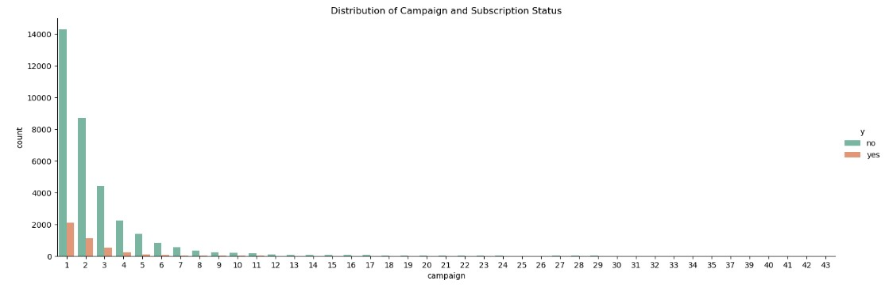

The plot provides a clear visualization of the number of contacts made during the current marketing campaign, segmented by the clients' subscription status to a term deposit. It illustrates how the frequency of client outreach correlates with whether clients ultimately subscribed ('Yes') or did not subscribe ('No') to the term deposit offer. Upon examining the plot, it becomes evident that the subscription rate for clients who answered 'No' (indicating they did not subscribe) is significantly higher than for those who answered 'Yes' (indicating a successful subscription). This indicates that despite the campaign's outreach efforts, a large portion of clients remains uninterested in the term deposit offer, which suggests a relatively low success rate for conversions. Furthermore, this insight could signal potential inefficiencies in the campaign's targeting strategy or the need for adjustments in the way clients are approached or the product is marketed. It may be worth exploring whether increasing the number of contacts for certain client segments, or focusing on more personalized communication, could enhance the conversion rate and lead to a higher number of successful term deposit subscriptions in future campaigns

3. **Multivariate Analysis:**

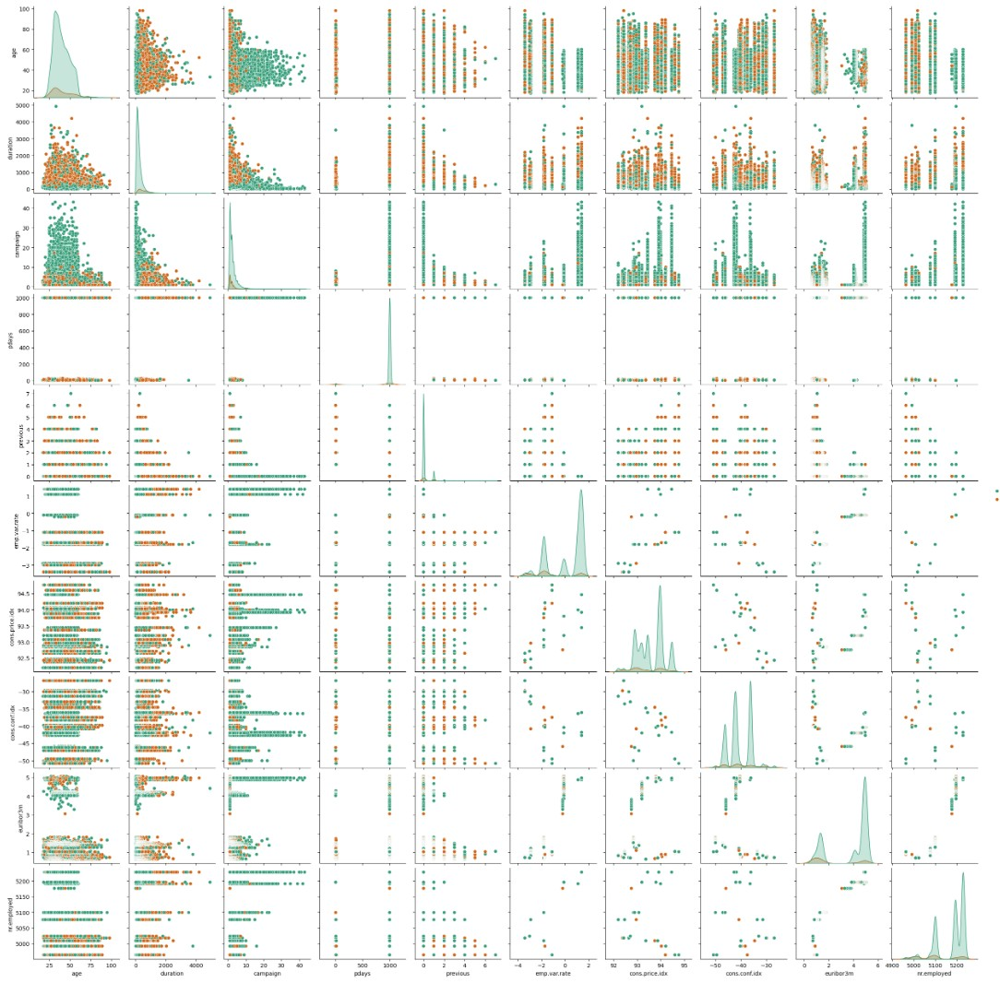

The analysis reveals a strong positive correlation between age and the number of contacts made during the campaign for clients aged between 20 and 60. This indicates that individuals within this age group are more frequently targeted by the marketing efforts, suggesting that the campaign may be specifically designed to engage this demographic more than others. The higher frequency of contacts for this age group could reflect the campaign's focus on individuals who are perceived to have greater financial stability or a higher likelihood of subscribing to the term deposit. Furthermore, the positive correlation between age and campaign frequency suggests that marketing strategies might be tailored to prioritize this age range, either due to a higher probability of success or based on past engagement patterns.

In addition to the age and campaign correlation, a moderate positive correlation is observed between the consumer price index (CPI) and the number of campaign contacts. This suggests that, as the CPI increases — possibly reflecting inflation or changes in economic conditions — the frequency of campaign outreach also rises. This relationship could indicate that the marketing team may be adjusting its outreach efforts based on economic indicators, possibly to address changing consumer behavior or to target clients when financial decisions are more likely to be influenced by shifts in the economy. These insights provide valuable information that can help refine the targeting strategy and the timing of the campaign, ensuring it aligns with both demographic factors and economic conditions.

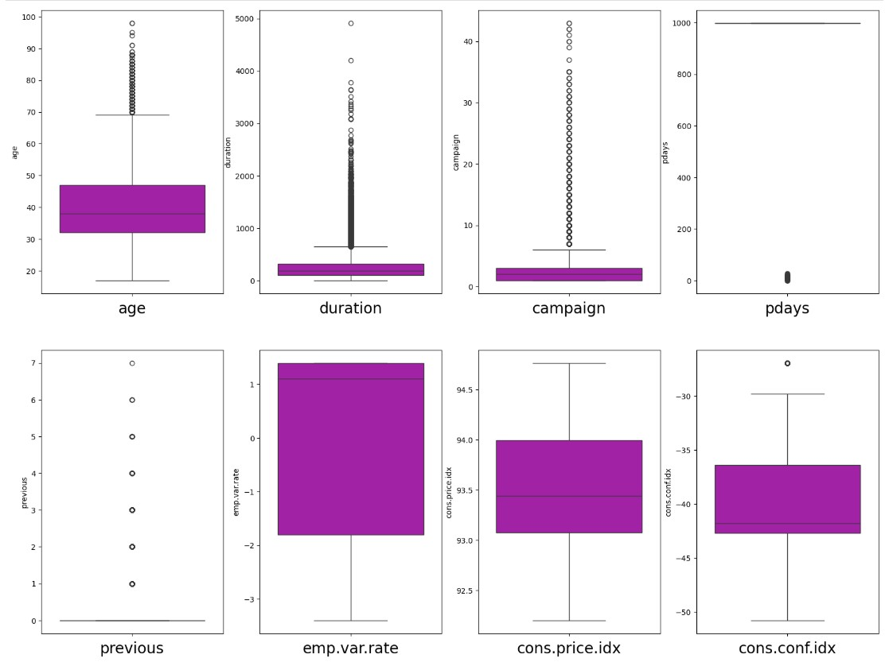

The boxplots above offer a visual summary of the distributions of the numerical columns, providing a clear representation of key statistical measures such as the median, quartiles, and potential outliers for each attribute. The central line within each box represents the median, which indicates the middle value of the data. The box itself spans from the first quartile (25th percentile) to the third quartile (75th percentile), encompassing the interquartile range (IQR), where the bulk of the data lies. The "whiskers" extending from the box indicate the range of data within 1.5 times the IQR from the quartiles. Any data points outside this range are considered outliers and are typically marked individually. By using boxplots, we can quickly assess the spread, central tendency, and any extreme values or outliers within the dataset, which is valuable for data exploration and preparation.

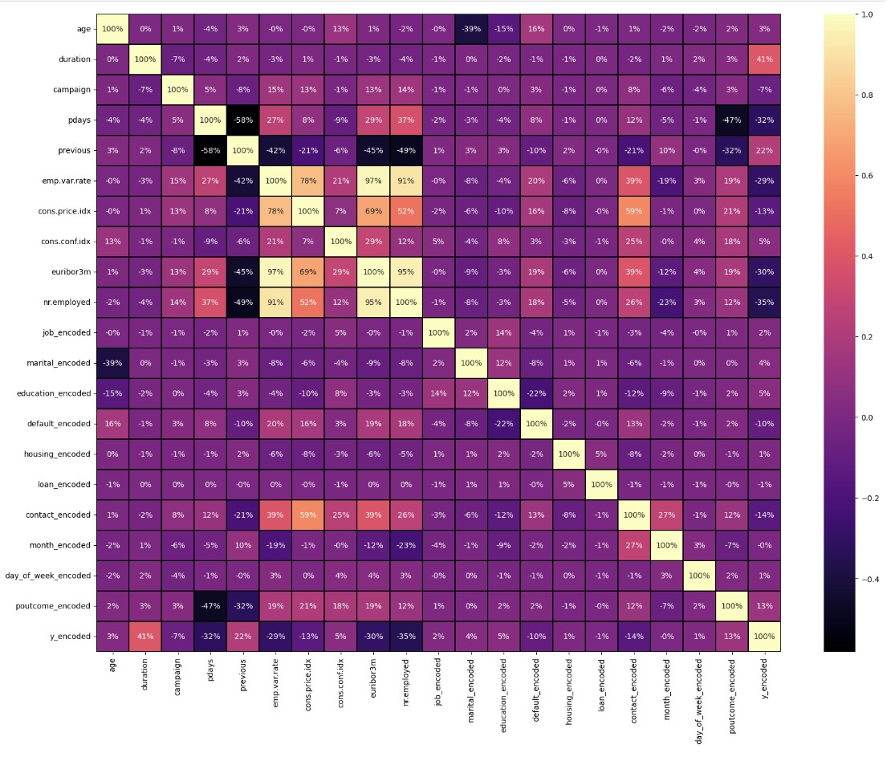

The heatmap displayed above is a powerful visual representation of the correlation matrix for the dataset. A correlation matrix is a table showing the correlation coefficients between variables, which helps to identify the relationships between them. In this case, the heatmap uses color intensity to communicate the strength and direction of these relationships. Specifically, darker colors represent stronger correlations, while lighter colors indicate weaker ones.

From the heatmap, we can observe that certain variables, such as "pdays" and "poutcome", exhibit a strong negative correlation. This means that as the value of one variable increases, the value of the other tends to decrease significantly, and the relationship between them is quite pronounced. The negative correlation implies that higher values of "pdays" (the number of days since the last contact with a client) tend to coincide with lower values of "poutcome" (the outcome of the previous marketing campaign).

Similarly, another strong negative correlation is evident between "pdays" and "previous", which measures the number of contacts performed before the current one. This suggests that as "pdays" increases, "previous" decreases in a predictable, strong manner. The precise correlation values, which are annotated on the heatmap, provide exact percentage figures to quantify these relationships.

The annotations allow for an even deeper understanding of the dataset by providing exact correlation coefficients between each pair of variables. For example, a correlation coefficient of -0.8 or -0.9 would indicate a very strong negative relationship, which is easier to interpret when looking at the annotations. This feature makes it easier for analysts to quickly spot which variables are most strongly related to each other, whether positively or negatively.

In summary, this heatmap not only helps visualize the overall structure of relationships within the dataset but also allows for a more granular understanding of how variables like "pdays", "poutcome", and "previous" are interrelated. By focusing on the strongest correlations, one can identify which features might be important for further analysis or model development.

### Splitting the Data into Training and Testing: 

We will begin by splitting the dataset into training and testing subsets. This is a crucial step in building a reliable machine learning model, as it allows us to train the model on one portion of the data and evaluate its performance on unseen data. The split ratio between training and testing sets can be adjusted based on the specific needs of the analysis, though a common practice is to use a standard split such as 70/30 or 80/20. Choosing an appropriate split ensures that the model has enough data to learn meaningful patterns while still being evaluated fairly on data it has not encountered during training.

### Basic Model Development: 

Once the dataset is split into training and testing sets, the next critical step is to build baseline classification models using a variety of algorithms. In this assignment, we focus on four widely used machine learning classifiers: Decision Tree, k-Nearest Neighbors (k-NN), Support Vector Machine (SVM), and Logistic Regression. Each of these models offers unique strengths and approaches to classification tasks. The goal of building these baseline models is to evaluate their initial performance on the dataset, using consistent metrics such as accuracy, precision, recall, and F1-score. This comparison helps identify which algorithm is most suitable for the given problem. Moreover, establishing baseline results sets the foundation for further model tuning and optimization in later stages, such as hyperparameter tuning, feature selection, or ensemble techniques. By systematically evaluating and comparing these models, we can make informed decisions about which classifier best balances performance, complexity, and interpretability for the task at hand. 

### Model Evaluation and Comparision 
Model evaluation in classification tasks is a crucial step to assess how well a model performs in predicting categorical outcomes. It involves using a variety of metrics that go beyond simple accuracy, providing a more comprehensive view of model performance. Common evaluation metrics include the confusion matrix, precision, recall, F1-score, and accuracy. Accuracy measures the overall correctness of the model, but it can be misleading when dealing with imbalanced datasets. Precision focuses on the proportion of correct positive predictions, while recall measures the model's ability to identify all relevant positive cases. The F1-score, as the harmonic mean of precision and recall, offers a balanced evaluation metric, especially useful when false positives and false negatives carry different consequences. Additionally, techniques such as cross-validation help ensure the model's performance is consistent and not just a result of overfitting to a particular dataset. Proper evaluation allows for informed decision-making when selecting and fine-tuning classification models for real-world applications.

